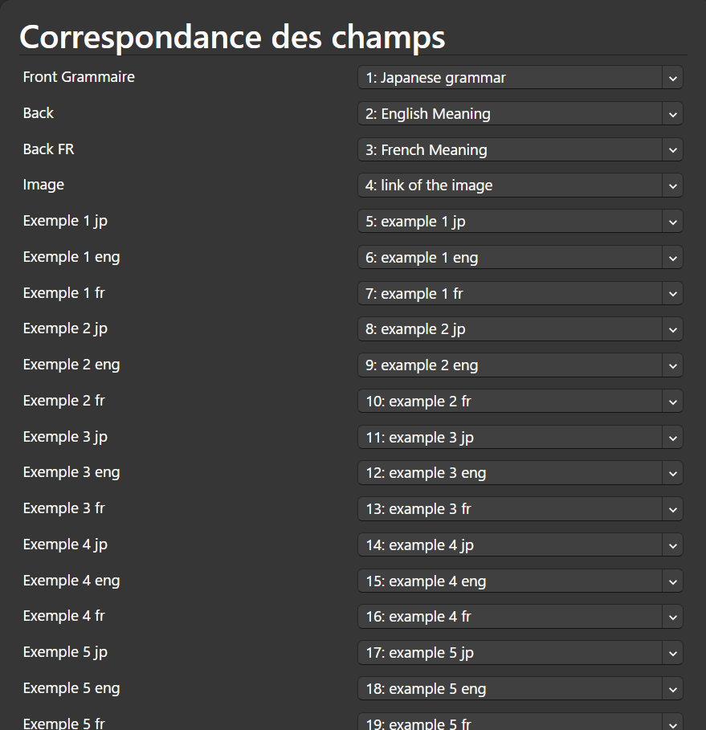
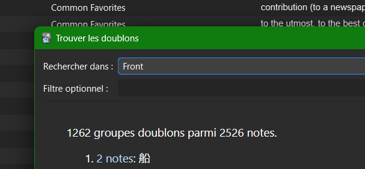
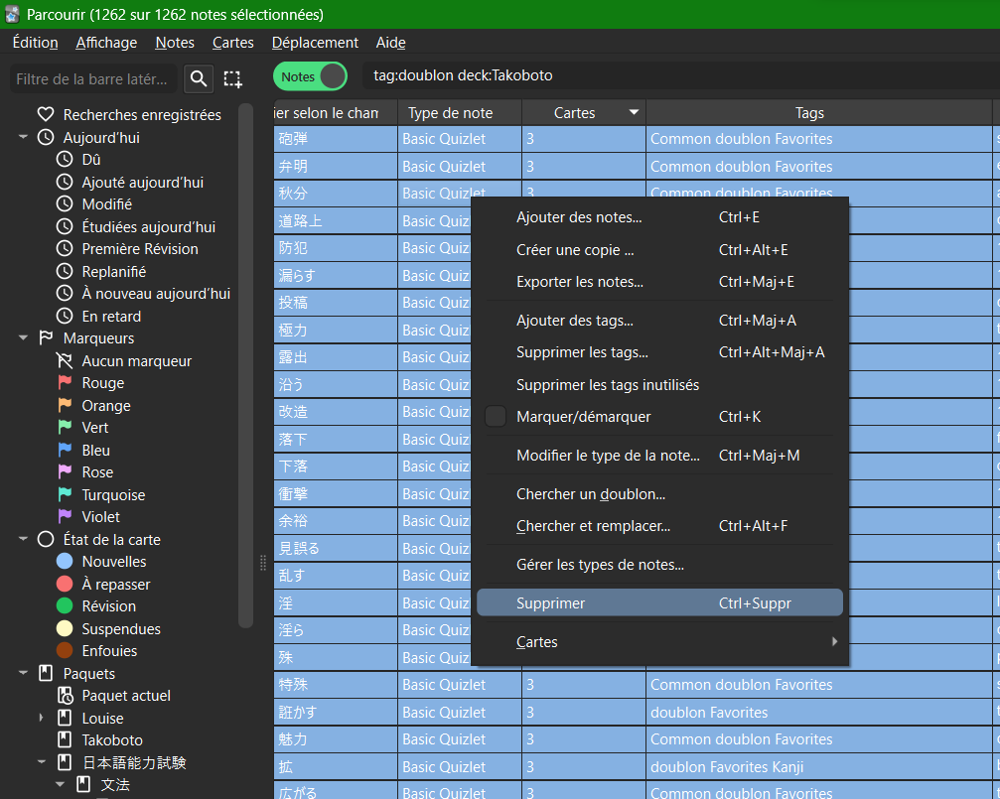

# JLPT SCRAPPER

Scrap over the JLPT-Sensei Website in a Anki readable CSV

## Installation

```powershell
conda create --name jlpt-scrapper
conda activate jlpt-scrapper
```

Multiple libraries are needed, using pip
```powershell
pip install requests beautifulsoup4 deepl alive-progress
```

## Launch

```powershell
python ./scrapper.py
```

Multiple parameters will be asked :
- Do you want to use Deepl to translate the grammar automatically from english to french ?
  
    It will use the deeplApi to automatically translate all the sentences from the meaning to the examples in french. But it requires a deeplApi account key (which is free)
    - yes : paste the deepl Api key, will translate
    - no :  will not translate
- Enter the JLPT level to scrape (N1, N2, N3, N4, N5): 
Each level can be scrapped, it will create a different output csv

## How to transfer in Anki ?
1) Import the [Anki package](GrammarWithExample.apkg) in Anki (File->Import) so that the new Card Type "Grammaire avec exemples" is created
2) You can already delete this deck
3) You need to copy the downloaded images (in the folder `images` ), to the folder `collection.media` which is at the root of Anki, in Windows, it should be located in `C:\Users\{USER}\AppData\Roaming\Anki2\{AnkiUser}\collection.media\`
4) Import the csv file output by the python that way
    
    Make sure to select "virgule" and the HTML box
    
    Make sure everything is aligned, it should be automatic

## Transférer les favoris Ankidroid
- Aller dans les favoris Takobot Japanese Dictionary
    
- Send to Ankidroid
    
- Synchroniser sur téléphone, puis sur PC
- Un Deck Takoboto a été créé
    
- Il faut changer le type de note, aller dans le deck Takoboto, puis Parcourir
    
- Sélectionner toutes les notes (Ctrl+A), changer le type de notes
    

- Renseigenr le type de note habituel (Chez moi c'est Basic Quizlet), avec les champs à transférer du type de note Takoboto (Japanese, Meaning, Reading) vers les champs du type de note Basic Quizlet
    
    
- Mtn qu'on a changer les types de notes, on peut vérifier les doublons
- CHercher les doublons, dans le champ voulu (chez moi le champ Front corresepond au japonais, et c'ets là où je veux pas de doublons)
    
    
- Taguer les doublons
    
- Mtn on va chercher à supprimer uniquement les doublons présnet dans le deck Takoboto (seulement les nouveaux venus). Dans parcourir faut renseigner tag:doublon deck:Takoboto, Entrée, Ctrl+A et supprimer
    
    

- UNIQUMENT SI TU VEUX LA TRADUCTION EN FR ET PAS EN ANGLAIS:
  - Faut installer un greffon: (outils -> greffon -> acquerir un greffon) : mettre ce code 972129549
  - Relancer anki
  - Retourner sur le deck Takoboto, Ctrl+A puis Edition, Deepl Translator, pareil ici faut avoir une clef API Deepl, si tu veux le faire plus tard, juste ajoute un tag à tout les mots genre (to_translate), comme ça tu pourras les sélectionner simplement plus tard
        
  - Faut renseigner de quel champ à quel champ tu veux traduire, moi c'est de Back (en anglais) à Back (en français, en écrasant les données)
        

- Mtn que tout est propre faut déplacer les cartes dans un autre paquet que Takoboto. En gros Takoboto doit uniquement être un paquet provisoire le temps de nettoyer les mots (CTRL+A, changer de paquet)